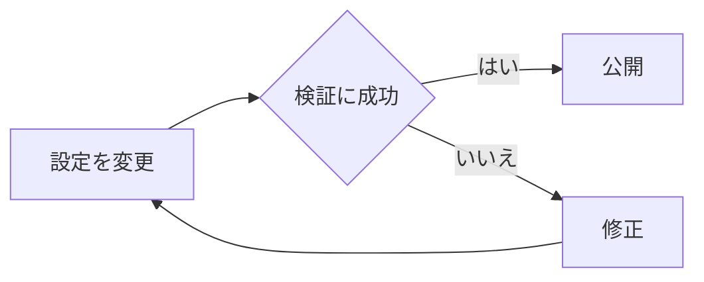

# kenchan0130.github.io エージェントガイド

このファイルは、kenchan0130.github.io の実装、運用、記事執筆に関する判断基準をまとめたものです。
リポジトリを変更するエージェントは、対象ファイルの既存実装とこのガイドを確認してください。

## ファイルの目的

- Astroによるブログ実装とGitHub Pages運用の前提を共有する
- 本番サービスの設定値や既存URLを、根拠なく変更しないための判断基準を示す
- 変更内容に応じた検証方法とCI設計を共有する
- ブログ記事執筆時の文体・構成・表現の統一を図るためのガイドライン
- AI やその他の執筆支援ツールを使用する際の参考資料
- 一貫性のある読みやすい記事を作成するための指針

## プロジェクトの前提

- Astroの静的サイトとしてビルドし、GitHub Pagesへデプロイする
- 記事は `src/content/posts/*.mdx` のContent Collectionで管理する
- サイト内検索にはPagefindを使用する
- 公開記事のURLは `/post/YYYY-MM-DD-N` を維持する
- 本番ブランチは `development` とし、GitHub ActionsからPagesへデプロイする
- Node.jsは `.node-version` と `package.json` の指定に従う
- パッケージマネージャーは `pnpm@10.34.5` を使用する
- 詳細な運用設定は `docs/operations.md` を参照する

## 作業開始時の確認

- 最初に `git status -sb` と `git branch --show-current` を確認する
- このワークスペースは共有されることがあるため、編集前とコミット前にブランチと差分を再確認する
- ユーザーや別作業の未コミット差分を削除、上書き、同一PRへ混在させない
- 広告、CI、記事など目的が異なる変更は、原則として別ブランチ・別PRに分ける
- 既存の挙動や設定値を変更するときは、推測せずGit履歴、公開HTML、既存設定を照合する

## 依存関係とコマンド

- Corepackを使用し、`packageManager`と`engines.pnpm`に指定されたpnpmを実行する
- 依存関係は完全固定バージョンを使用し、キャレットやチルダを追加しない
- pnpmの厳密なバージョンチェックを、検証の都合で無効化しない
- 主なコマンドは次のとおり
  - 開発サーバー: `pnpm dev`
  - フォーマット確認: `pnpm format:check`
  - lint: `pnpm lint`
  - Astro・TypeScript確認: `pnpm check`
  - 本番ビルド: `pnpm build`
  - 生成物確認: `pnpm verify:build`
  - E2E・アクセシビリティ: `pnpm test:e2e`
  - 全体確認: `pnpm test`
- `pnpm lint` はコンテンツ検証と変更記事のtextlintを含むため、CIで同じ検証を重複実行しない

## 本番サービスの識別子

- 外部サービスの識別子を、例示値や推測した値へ置き換えない
- 外部サービスの設定を変更するときは、Git履歴、公開サイト、管理画面上の根拠を照合して既存値を維持する
- 現在の公開識別子は `src/config/site.ts` を単一の参照元とする
  - GA4測定ID: `G-B7RX34Q5PL`
  - AdSenseクライアントID: `ca-pub-2444060431947599`
  - AdSense記事スロットID: `7319689305`
  - `ads.txt` Publisher ID: `pub-2444060431947599`
- これらの公開識別子を意図的に変更するときは、ユーザーの明示的な指示または管理画面上の根拠を確認し、関連文書も更新する
- APIキーや管理用トークンなどの秘密情報は、リポジトリや生成物へ含めない

## Astroのインラインスクリプト

- `<script is:inline>` の本文には、実行するJavaScriptを直接記述する
- JavaScript全体をAstroの式展開で文字列として渡さない。次の形式は、生成HTMLで文字列評価になるだけで処理が実行されない

```astro
<script is:inline>{`window.example();`}</script>
```

- ビルド時変数は `define:vars` を使用し、スクリプト本文から参照する

```astro
<script is:inline define:vars={{ measurementId }}>
  window.example(measurementId);
</script>
```

- JSON-LDのように文字列をそのまま埋め込む用途と、実行可能なJavaScriptを混同しない
- Astroのソースだけで正しさを判断せず、`pnpm build` 後の `dist` に実行可能なコードが生成されていることを確認する

## GA4とAdSense

- GA4は外部スクリプトの読み込みだけでなく、`gtag("config", ...)` が生成HTMLで実行されることを確認する
- AdSenseは次をすべて満たすことを確認する
  - クライアントIDとスロットIDが既存設定と一致する
  - `(adsbygoogle = window.adsbygoogle || []).push({})` が実行可能なJavaScriptとして出力される
  - レスポンシブ広告の親要素と `ins.adsbygoogle` が、初期化時に0より大きい幅を持つ
  - 広告の高さを固定して、レスポンシブ広告の展開を妨げない
- AdSenseが広告クリエイティブを返すかどうかは、在庫、審査、閲覧環境、コンテンツブロッカーなどにも依存する
- テストでは「コードが生成された」「広告リクエストを開始できる」を検証し、実際の広告表示やGA4への送信成功を必須条件にしない

## 検証方針

- 記事変更: `pnpm lint`
- Astro・TypeScript変更: `pnpm lint`、`pnpm check`
- レイアウト・生成HTML変更: `pnpm build`、`pnpm verify:build`
- UI・操作変更: `pnpm test:e2e`
- GitHub Actions変更: `actionlint .github/workflows/*.yml`
- 本番限定の分岐は、開発サーバーだけで検証せず、本番ビルドとpreviewまたは生成HTMLで確認する
- 外部サービスに依存する挙動は、可能な限り `scripts/verify-generated-output.mjs` で決定的に検証する
- E2Eは外部広告の配信や解析サービスの応答を待つテストにしない
- 失敗したテストを、原因を確認せず削除・skip・条件緩和して通さない

## CIとGitHub Pages

- CIは `quality` と `build-test` を並列実行する
  - `quality`: audit、format、lint、型チェック
  - `build-test`: build、生成物検証、Playwright
- `deploy` は `quality` と `build-test` の両方に依存させる
- matrix化やジョブ分割は、セットアップの重複と総実行時間も考慮し、実測値に基づいて採用する
- GitHub Actionsは完全なコミットSHAへ固定し、同じ行に正確なリリースバージョンをコメントする
- GitHub PagesのSourceはGitHub Actions、本番デプロイ対象は `development` ブランチとする
- workflowのジョブ名を変更したときは、ブランチ保護設定と `docs/operations.md` の必須チェック名も確認する
- GitHub側の環境・Pages設定は、リポジトリコードから暗黙に変更せず、必要性と影響を確認してから変更する

## 文章の基本スタイル

### 記事ファイルとfrontmatter

- 記事ファイルは `src/content/posts/YYYY-MM-DD-N.mdx` とし、ファイル名を公開URLのIDとして扱う
- `title`、`published`、1件以上の `categories` を必須とし、検索結果とOGPに使われる `description` も原則として記載する
- `description` は記事の冒頭をそのまま複製せず、検索結果だけを見ても内容を判断できる短い要約にする
- `tags` は検索用の補助情報として、本文で扱う製品名、技術名、プラットフォーム名などに絞る
- 関連記事を明示する場合は、`references` に対象記事のIDを追加する
- 公開前の記事だけ `draft: true` とし、公開するときは `false` に戻す

### 文体

- **基本文体**：です・ます調で統一
  - 例：「〜されました」「〜します」「〜できます」
  - 避ける：である調（「〜である」「〜だ」）

### 段落構成

- **1段落の長さ**：2〜5文程度
- **改行の使い方**：意味のまとまりごとに段落を分ける
- **箇条書きの活用**：技術的な説明や手順説明では積極的に使用

### よく使う表現・フレーズ

#### 記事の導入部
- 「今回は〜について紹介します」
- 「〜がリリースされました」
- 「〜で発表された〜」

#### 説明・解説
- 「〜することで、〜できます」
- 「〜する必要があります」
- 「〜となります」「〜となる予定です」
- 「〜する場合は」
- 「詳しくは〜を参照してください」

#### 意見・推測
- 「〜と思います」
- 「〜と考えています」
- 「〜かもしれません」
- 「〜ではないでしょうか」

#### 接続詞
- 「また、」（追加情報）
- 「しかし、」「ただし、」（逆接・注意）
- 「そのため、」「これにより、」（因果関係）
- 「たとえば、」（具体例）

### 読者との距離感

- 丁寧語を基本とし、親しみやすさを保つ
- 断定的な表現を避け、柔らかい表現を使用
- 読者の知識レベルを想定し、専門用語は初出時に説明
- 事実と筆者の感想であることがわかるようにする

### 具体例の使い方

- 「たとえば、〜のような場合」で実例を提示
- コードブロックで実際の設定例を示す
- スクリーンショットで視覚的に説明
- ユースケースを明確に提示

## 執筆の基本方針

### 記事を書く目的

1. **技術情報の共有**：自分が学んだ・解決した技術的な内容を他者と共有
2. **備忘録**：将来の自分や他の人が参照できる形で知識を整理
3. **コミュニティへの貢献**：日本語での技術情報を充実させる

### 内容の選定基準

- 自分が実際に試した・経験した内容
- 公式ドキュメントだけでは分かりにくい点の補足
- 日本語情報が少ない技術トピック
- イベントやカンファレンスで得た新しい知見

### 情報開示のバランス

- 一次情報（公式ドキュメント）への参照を必ず含める
- 自分の環境・前提条件を明記
- 成功例だけでなく、注意点や制限事項も記載
- セキュリティに配慮し、機密情報は含めない

### 避けている表現・好んで使う表現

#### 避ける表現
- 断定的すぎる表現（「絶対に」「必ず」）
- 読者を見下すような表現
- 不必要な専門用語の羅列

#### 好んで使う表現
- 「〜できます」（可能性を示す）
- 「〜と思います」（意見であることを明示）
- 「参考：」「注意：」（情報の種類を明確化）

## 記事の構成要素

### 典型的なタイトルの付け方

#### パターン
1. **実践系**：「〜する」「〜してみた」
   - 例：「Terraform で AWS アカウントを跨いだリソース管理をする」
2. **解説系**：「〜について」「〜の紹介」
   - 例：「Apple Business Manager の User Enrollment について」
3. **ニュース系**：「〜で発表された〜」
   - 例：「WWDC 2024 で発表された iOS の新機能」

#### タイトルの特徴
- 具体的な技術名・製品名を含める
- 記事の内容が一目で分かるようにする
- 検索されやすいキーワードを含める

### 導入部の書き方

1. **背景説明**：なぜこのトピックを扱うのか
2. **対象読者**：誰向けの記事なのか（必要に応じて）
3. **記事の概要**：何について説明するのか
4. **前提条件**：必要な知識や環境

例：
```markdown
先日、AWS で複数アカウントを管理する必要が出てきました。
今回は、Terraform を使って AWS アカウントを跨いだリソース管理を
実現する方法について紹介します。

この記事では、以下の内容を扱います：
- AssumeRole の設定方法
- Terraform での provider 設定
- 実際の使用例
```

### 本文の展開パターン

1. **概要説明**：トピックの基本的な説明
2. **詳細説明**：技術的な詳細、仕組みの解説
3. **実装・設定例**：具体的なコードや設定
4. **動作確認**：実際の動作や結果
5. **注意点・トラブルシューティング**：ハマりポイントや解決策

### 結びの特徴

- 「終わりに」「まとめ」セクションを設ける
- 記事の要点を簡潔にまとめる
- 今後の課題や発展的な内容への言及
- 参考資料へのリンク集

例：
```markdown
## 終わりに

今回は〜について紹介しました。
〜することで、〜が実現できます。

今後は〜についても試してみたいと思います。
```

## その他の特徴

### 記号・括弧の使い方

- **「」（かぎ括弧）**：用語の強調、UI の文言、引用
  - 例：「AssumeRole」を使用します
- **（）（丸括弧）**：補足説明、英語表記の併記
  - 例：ユーザー登録（User Enrollment）
- **``（バッククォート）**：インラインコード、コマンド、ファイル名
  - 例：`terraform apply` コマンドを実行
- **太字（`**`）**：特に重要なポイント
  - 例：**注意：この設定は必須です**

### 数字・期間の表記

- **西暦**：半角数字（2024年）
- **バージョン**：半角英数字（v1.0、iOS 17、macOS 14.0）
- **時間**：漢字表記（3時間、30分）
- **日付**：YYYY-MM-DD 形式（2024-12-16）

### 引用やコードブロックの使い方

#### コードブロック
- 言語を必ず指定（```sh、```hcl、```yaml など）
- 実行可能なコード例を提示
- 長いコードは重要部分を抜粋
- ファイル名が理解を助ける場合は、開始フェンスに `title="ファイル名"` を指定
- 読者に注目してほしい行は `{1, 4-6}`、追加行は `ins={...}`、削除行は `del={...}` で示す
- 複数の状態や手順を同じコードで説明する場合は、`ins={"変更後":4-6}` のように行ラベルを付ける
- 変更前後を示すときは `diff lang="元の言語"` も使用できる
- 強調は説明に必要な最小範囲に留め、コードブロック全体を装飾しない

````markdown
```ts title="src/example.ts" ins={"変更後":2}
export const settings = {
  timeout: 3000,
};
```
````

#### 引用
- 公式ドキュメントからの引用は > を使用
- 出典を明記

### 画像の使い方

- 画像には代替テキストを設定
- UI の説明では画像を積極的に活用
- 画像は `public/assets/posts/post/記事ID` ディレクトリに保存
- 記事からは `/assets/posts/post/記事ID/sample.png` のように参照
- 代替テキストは必須。説明目的を持たない画像だけ明示的に空の代替テキストを使う
- 画像のMarkdownタイトルは、本文とは別にキャプションが必要な場合だけ指定する
- 画像追加後は `pnpm optimize:images` を実行し、生成されたWebPもコミットする
- 本文画像は共通の画像コンポーネントで寸法、遅延読み込み、レスポンシブ画像を補うため、独自の`img`要素を直接記述しない

```markdown

```

### Mermaid図

- 処理の流れ、状態遷移、構成要素の関係が、文章や短い箇条書きより理解しやすくなる場合に使用する
- 単純な一方向の手順や、本文と同じ情報を繰り返すだけの図には使用しない
- `mermaid` のコードフェンス内に記述し、MDX側で`import`しない
- ノードのラベルは短くし、本文で用語や判断理由を補足する
- ライト・ダーク両テーマと狭い画面で、文字と線が読み取れることを確認する

````markdown

````

### MDXコンポーネント

- 公開後の追記には `<Revision date="YYYY-MM-DD">...</Revision>` を使用し、通常の本文更新と区別する
- 記事の理解に重要な外部ページは `<LinkCard href="https://example.com" />` で視覚的に示す
- 本文中の補足リンクまでカード化しない。同じURLについて通常のリンクとリンクカードを重複させない
- `Revision` と `LinkCard` は記事ページから提供されるため、記事側で`import`しない
- `LinkCard` を追加・変更したら `pnpm refresh:link-cards` を実行し、更新されたメタデータもコミットする
- 記事内の任意の`import`、`export`、iframe、Liquid記法は使用しない

```mdx
<Revision date="2026-01-15">
  仕様変更後の手順を追記しました。
</Revision>

<LinkCard href="https://example.com/reference" />
```

### リンクの書き方

- 公式ドキュメントへのリンクを優先
- 日本語記事がある場合は併記

## textlint 準拠事項

- `pnpm lint` が通ることを確認
- 文体の統一（です・ます調）
- 適切な句読点の使用
- 冗長な表現の回避

## 記事作成時のチェックリスト

- [ ] タイトルは内容を適切に表しているか
- [ ] 導入部で記事の目的が明確か
- [ ] 技術用語に説明があるか
- [ ] コード例は動作確認済みか
- [ ] スクリーンショットは最新か
- [ ] 参考リンクは有効か
- [ ] textlint のチェックは通るか
- [ ] 機密情報は含まれていないか
