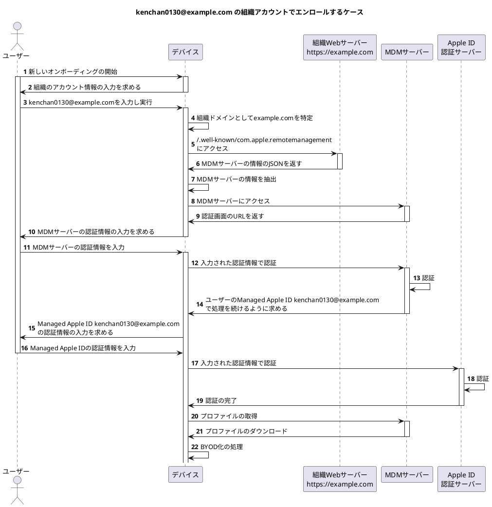

日本時間2021年6月8日〜6月12日にかけて、Apple社が主催するWWDC（世界開発者会議）2021が開催されました。
その中で、今年もエンタープライズ機能のアップデートが紹介されました。

今回は、WWDC 2021で紹介されたいくつかの機能をまとめてみました。

* TOC
{:toc}

## iOS/iPadOSに関するアップデート

以下のアップデートのほとんどが、iOS/iPadOS 15から実現される予定です。

### VPNとデバイスマネージメントの画面の統合


管理に関係する項目は「設定」アプリケーションの至るところに点在していたため、エンドユーザーが現状を把握することが難しい状態でした。

iOS/iPadOS 15では、VPNとデバイス管理の画面が統合され、デバイスの状態を1つの包括的な場所で表示できる予定です。

この画面では、

* VPNの管理
* User Enrollmentのアカウントの管理
* プロファイルの管理

が可能となる予定です。

### User Enrollemnt配下のデバイスへのアプリケーションの強制インストール


User Enrollment配下のデバイスでは、組織からアプリケーションをインストールさせる場合、アプリケーションごとにエンドユーザーが許可および拒否が選択できます。
しかし、これだとMDMベンダーの管理アプリケーションすらインストールされない可能性があります。

この問題を解決するために、User Enrollment配下のデバイスに対して、1つだけ強制的にアプリケーションをインストールできるようになる予定です。
アプリケーションのインストールの同意に関しては、User Enrollmentのプロファイルのインストール中に行われるため、無断でインストールされるわけではありません。

### Managed pasteboard


User Enrollment配下のデバイスの対してManaged Open Inと呼ばれる機能があります。
これにより、管理対象アプリケーションと管理対象外アプリケーションとの間で「共有」機能を介して添付ファイルや文書の行き来を制限できるようになりました。

このManaged Open Inのクリップボード版が**Managed pasteboard**です。
管理対象アプリケーションからコピーされた情報を管理対象外アプリケーションに貼り付け、およびその逆を行えません。

* カレンダー
* メモ
* メール
* ファイル

に対してもこの制限が適用されます。

現実的には、たとえばTwitterで見つけた記事を管理対象のチャットサービスに共有したいということがしばしばあります。
しかし、Managed Open Inを適用してしまうと、このようなユースケースが実現できなくなります。
これはエンドユーザーにとって良いUXではありません。

個人的には、「管理対象アプリケーションのOutは許可しないが、Inだけは許可する」といったような機能がないとManaged pasteboardを有効化しても同様の問題が発生する可能性があると考えています。

### 共有iPadにおける機能の強化


共有iPadにおいて一時的にログインができる一時セッションの機能が、昨年のWWDCで発表されました。[^kenchan0130-2020-07-01-1-shared-ipad]
この機能追加により、

* ユーザーログインを一時セッションのユーザーのみの制限
* 一時セッションのユーザーがログインできる最大期間の設定
* すべてのユーザーがログインできる最大期間の設定

の3つの機能が追加されました。
これらはiPadOS 14.5から使用できます。

[^kenchan0130-2020-07-01-1-shared-ipad]: 私の「[WWDC 2020で発表されたエンタープライズ関連の新機能 - 共有iPadの改善]()」記事でも紹介している

### User Enrollment配下のデバイスの管理アカウント情報確認画面


User Enrollment、つまりBYDO化されたデバイスにおいて、「設定」アプリケーションのトップに管理アカウント情報にアクセスするための動線が追加される予定です。管理アカウント情報の画面からはプロファイルなどの確認ができます。

今までは「設定」アプリケーションの**一般 > プロファイルとデバイス管理**の該当プロファイル画面でしか確認できなかったため、管理アカウント情報にアクセスしやすくなります。

### iOS/iPadOSにおけるManaged Apple IDのiCloudドライブのサポート


Managed Apple IDを使用してiCloudドライブが使えるようになる予定です。
iCloudドライブのデフォルトの容量は5GBですが、容量の追加などについては発表がありませんでした。

もしできるとなると、Apple Business ManagerやApple School Manager上で操作することになると予想しています。

### 新しいUser Enrollmentのオンボーディングフロー


User Enrollmentは、今まで最初にプロファイルをダウンロードして登録処理を行っていました。
新しいオンボーディングフローでは、以下のようになります。

1. デバイス上で組織のアカウント情報を入力
1. アカウント情報からドメイン情報を判別
1. `https://アカウント情報のドメイン/.well-known/com.apple.remotemanagement` に対してGETリクエストを送信しJSONを取得
1. JSON内のMDMサーバーのURLにアクセスして、MDMサーバー側でユーザーを認証
1. MDMサーバー上で事前にユーザーに紐付けたManaged Apple IDを使用してユーザーを認証
    * Managed Apple IDの認証画面において、Managed Apple IDのメールアドレスが自動で補完される挙動のようですので、Managed Apple IDを紐付けなくてもよい可能性があります
1. User Enrollmentのためのプロファイルがダウンロードされ、デバイスをBYOD化

上記のフローにおける `https://アカウント情報のドメイン/.well-known/com.apple.remotemanagement` にGETリクエストを行った場合、

```json
{
  "Servers": [
    {
      "Version": "mdm-byod",
      "BaseURL": "MDMサーバーのURL"
    }
  ]
}
```

のようなJSONを返すようにする必要があります。
また、未確認ですが、`Servers`が配列であるため、MDMサーバーを複数指定したら選択できるかもしれません。

フローが少々分かりづらいため、おそらくこうであろうと思われるシーケンス図を書いてみました。
もし間違っていましたらご指摘ください。








## macOSに関連するアップデート

主に2021年秋にリリース予定のmacOS Montereyにて追加される新機能や関連するアプリケーションなどを紹介します。

macOS Big Surのマイナーアップデートに関しては、[What's new for enterprise in macOS Big Sur](https://support.apple.com/en-lamr/HT211911)も合わせてご確認ください。

### System Extensionsの削除機能


管理者はMDMを介して、任意のアプリケーションがSystem Extensionsを使用する場合、System Extensionsを許可しアクティブにできました。
しかし、該当のアプリケーションを削除しても、System Extensionsの情報がデバイスに残ったままになっていました。[^remove-system-extension-workaround]

[^remove-system-extension-workaround]: System Integrity Protection（SIP）を無効にして`systemextensionsctl reset`コマンドを実行する方法、もしくはGUIで該当のSystem Extensionsを含むアプリケーションをゴミ箱に移動するとダイアログがでてくるので、管理者権限でSystem Extensionsを削除するという方法しかなかった

今回のアップデートにより、System Extensionsがリムーバブルとなります。

おそらくですが、`systemextensionsctl reset`コマンドなどを用いて、管理者権限を用いずともSystem Extensionsを削除できるようになると考えています。

### RestartDeviceコマンドの強化


`RestartDevice`コマンドでは、Big Surから以下の2つのオプションが使用できるようになりました。

* カーネルキャッシュの再構築
  * Kernel Extensionsをロードできるようにする
* OSによって検出されないKernel Extensionsを指定
  * 再起動前にユーザーがKernel Extensionsを内包するアプリケーションを起動しなくても、Kernel Extensionsを読み込むことができる

今回新たに**エンドユーザーに対して通知を表示する**オプションが追加される予定です。
これにより表示されるプロンプトをクリックすると、グレースフルシャットダウンが実行されます。

この機能はJamf Proには実装されていないため[^macos-remote-restart-and-shutdown-via-mdm-command] [^jamf-now-remotely-restarting-or-shutting-down-devices]（正確にはAPI経由では実行できます）、存在を知りませんでしたが、エンドユーザーにとっては、なぜ再起動されるのかがわかると次のアクションつなげやすかったり、安心できたりするので良いと思います。

[^macos-remote-restart-and-shutdown-via-mdm-command]: [macOS remote Restart and Shutdown via MDM Commands](https://ideas.jamf.com/ideas/JN-I-21241)という機能リクエストは出ている
[^jamf-now-remotely-restarting-or-shutting-down-devices]: Jamf Nowには[機能](https://support.jamfnow.com/s/article/Remotely-Restarting-or-Shutting-Down-Devices)として用意されている

### Appleシリコンのリモートロック機能


今までAppleシリコンを搭載したMacでは、`DeviceLock`コマンドを実行するとrecoveryOSが起動していました。[^kenchan0130-2020-12-28-1]

今回のアップデートにより、Intel版のMac同様、管理者は6桁のPINを使用してデバイスをリモートでロックできます。
また、リモートロックの画面にはメッセージと電話番号を表示できます。これもIntel版と同様の挙動です。

[^kenchan0130-2020-12-28-1]: 「[Appleシリコンを搭載したMacデバイスのロックの挙動について]()」を参照

### Appleシリコンのリカバリパスワード機能


Appleシリコンを搭載したMacでは、リカバリモードで起動すると、初期化や意図しないデータへのアクセスが可能でした。

今回のアップデートにより、Appleシリコンを搭載したMacをリカバリモードで起動する際に、事前にMDMで設定したパスワードを入力を要求できるようになる予定です。
デバイスからMDMが登録解除されると、このパスワードは自動的に削除されるそうです。

Intel版のMacでは、ファームウェアパスワードを設定することでリカバリモードの起動を制限できていましたが、AppleシリコンのMacではファームウェアパスワードが使用できなくなっていました。
この機能を使用すると、ファームウェアパスワードよりも柔軟に制限が可能となります。

この機能をアクティベーションロック機能と一緒に使用することが推奨されるそうですが、Managed Apple IDではアクティベーションロック機能が使用できないため、個人的にはぜひそこをなんとかしてほしいと思いました。

ここで言う「**デバイスからMDMが登録解除される**」が、

* 該当プロファイルの削除
* Apple Business Manager/Apple School MangerでMDMのデバイス割り当ての解除

のどちらを指しているかがわからなかったため、もしわかる方がいらっしゃいましたら教えてください。

### すべてのコンテンツと設定を消去する機能


Macデバイスを初期化する場合、リカバリモードからデータを削除してOSをインストールし直す必要がありました。

今回のアップデートにより、AppleシリコンまたはT2セキュリティチップを搭載したMacデバイスのみ、`EraseDevice`コマンドおよびシステム環境設定のペインからiOS/iPadOSのように、すぐに初期化できます。

また、この機能を制限するための新しい`allowEraseContentAndSettings`属性も追加されます。

もしコマンドラインなど、API呼び出しにより「すべてのコンテンツと設定を消去」が実行できる場合、ワイパーウェアのようなものが出回ることが想定されます。
ただ、Apple社もすでにこれについて考慮しているそうですので、大きく心配する必要はないかもしれません。

### User Enrollment配下のデバイスの管理対象アプリケーションのボリューム分離


iOS/iPadOSのアップデートと同様に、管理対象アプリケーションのデータは別のボリュームに分離されるようになる予定です。
合わせて、MDMコマンドまたはデバイスがMDMから登録解除された際に、管理対象アプリケーションが削除される挙動になる予定です。

これは予想ですが、該当のアプリケーションが任意のディレクトリやファイルを操作している場合はそこまで追跡できないため、完璧にアプリケーションに関連するデータが削除されるわけではないと考えています。

### macOSにおけるManaged Apple IDのiCloudドライブのサポート


iOS/iPadOSのアップデートと同様に、Managed Apple IDを使用してiCloudドライブが使えるようになる予定です。

### Apple Configuratorによるリストアとリバイブ


Apple Configuratorを用いてリストアを実行すると、AppleシリコンまたはT2セキュリティチップを搭載したMacデバイスにおいて、

* すべてのコンテンツと設定の消去
* ファームウェアとリカバリOSの更新
* 最新のmacOSバージョンが再インストール
  * Appleシリコンを搭載したMacのみ

が実現できます。

これにより、Macデバイスを新しいユーザーに渡すことができます。

また、リバイブを実行すると、AppleシリコンまたはT2セキュリティチップを搭載したMacデバイスにおいて、ユーザーデータを保存しながらMacデバイスを復元できます。

これにより、ソフトウェアアップデート中に電源が切れてしまった場合などの復旧に使用できます。

この操作には、正しいThunderboltのポートにつなぐ必要がある点に注意が必要です。


### Apple ConfiguratorによるApple Business Manager/Apple School Managerへのデバイス登録


Apple Configuratorには、正規のビジネスチャネルで購入していないiOS/iPadOSのデバイスを、Apple Business Manager/Apple School Managerに追加（Device Enrollmentを使用）する機能があります。

今回のアップデートにより、AppleシリコンまたはT2セキュリティチップを搭載したMacデバイスでも、Apple Business Manager/Apple School Managerに追加（Device Enrollmentを使用）できるようになる予定です。
これには、新しくリリースされるiPhone版のApple Configuratorが必要です。

以下の手順で、Apple Business Manager/Apple School Managerに登録されます。

1. デバイスをアサインできる管理者の権限を持ったManaged Apple IDでログイン
1. iPhoneとMacデバイスを同じWi-Fiネットワーク内に接続する
1. Macデバイスのセットアップアシスタントの言語を選択
1. 国と地域の選択画面で、Apple Configuratorを起動したiPhoneを近付ける
1. Macデバイスにアニメーションが表示されたら、Apple Configuratorのカメラでアニメーションをキャプチャ

Apple Business Manager/Apple School ManagerでMDMサーバーにアサインし、Macを再起動すればDevice Enrollmentが始まります。

管理者としては組織で貸与しているMacデバイスはUser Enrollmentではなく、Device Enrollmentにしたいはずです。
そうなると、すでにエンドユーザーが使用しており、User Enrollmentなデバイスが問題になってきます。

これはあくまで推測であり、試してみないとわかりませんが、

1. MDMに関するプロファイルをすべて削除
1. `/var/db/.AppleSetupDone` を削除
1. Macデバイスを再起動

の手順を踏んで、再度セットアップアシスタントが起動するしくみを応用して、User EnrollmentなデバイスをDevice Enrollmentなデバイスにできるかもしれません。

### ソフトウェアアップデートの延期方法の拡充


macOS 10.13以降、ソフトウェアアップデートを遅延できていました。

macOS 11.3からは、メジャーバーションのアップグレードをマイナーバージョンのアップグレードよりも長く遅らせることができるようになりました。

これにより、既存のOSバージョンのマイナーバージョンおよびセキュリティアップデートをインストールできます。

### Appleシリコンの非対話型のソフトウェアアップデート


Appleシリコンを搭載したMacデバイスの場合、ソフトウェアアップデートには認証またはBootstrap Tokenが必要です。

インタラクティブにアップデートする場合は、エンドユーザーの認証が要求されます。
macOS 11.2以降、Bootstrap Tokenによる非対話型のソフトウェアアップデートが可能となりました。

macOS Monterey以降、Bootstrap Tokenと`InstallLater`というMDMコマンドを介して、デバイスが現在使用されていないことが検出して自動でソフトウェアアップデートが実行できるようになる予定です。

Intel版のMacデバイスでは「ソフトウェアアップデートが存在するかを確認して、存在していたら`softwareupdate`コマンドを実行する」といったスクリプトを書いて同様の機能を実現していました。
Appleシリコン版のMacデバイスで同じようなことをしようとすると少々面倒であったため、個人的にはうれしいアップデートだと思います。

### ソフトウェアアップデートの延期上限機能


ソフトウェアアップデートを利用できるようにした際に、エンドユーザーが常に延期やキャンセルを行うことは望ましい状態ではありません。

macOS Montereyでは、ソフトウェアアップデートの延期やキャンセルを行える上限を設定できるようになる予定です。
最大で3回まで設定でき、猶予を超えると強制的にソフトウェアアップデートが適用されます。

## MDMベンダー向けのアップデート

### macOSのApple Software Lookupサポート


iOS/iPadOSの場合、MDMソリューションはApple Software Lookup Service[^apple-software-lookup-service]を介して利用可能なアップデートを認識し、デバイスに直接コマンドをプッシュしています。

macOS Montereyでは、iOS/iPadOS同様にApple Software Lookup Serviceを使用したプロセスをサポートする予定です。

[^apple-software-lookup-service]: https://gdmf.apple.com/v2/pmvにリストがホスティングされている

### アセット管理APIの非同期処理


今まではアセット（組織がApple Business Manager/Apple School Managerで購入したアプリケーションや書籍）の管理に関するAPIの処理は同期的に行われていました。

そのため、大規模な組織でアセットをデバイスなどにアサインすると、パフォーマンスに影響がでてしまい多くの時間がかかっていました。

今回のアップデートにより、アセット管理のAPIが非同期で処理を行えるようになり、この課題を解決できる予定です。

### MDMサーバーへのリアルタイム通知


MDMサーバーが以下の通知をサブスクライブできるようになる予定です。

* アセットの状況
* アセットが組織で管理されているユーザーやデバイスへの割り当ておよび取り外し
* 登録ユーザーの状態変更
  * デバイスに対してアセットを割り当てることが多いかもしれないが、ユーザーに対してアセットを割り当てることもでき、その際にはユーザー登録が必要となる

非同期処理と合わせることで、アセットを一括で操作する際などのパフォーマンスが向上する可能性があります。

### Declarative Device Management


既存のMDMプロトコルではデバイスの数が増えると、MDMサーバーのパフォーマンスに大きな影響を与える可能性があります。

この問題を解決するためにDeclarative Device Managementと呼ばれる既存のMDMプロトコルを拡張する新たなパラダイムを導入する予定です。

まだiOS/iPadOSのUser Enrollmentでしか使用できないですが、Device EnrollmentやmacOSにも導入されるかもしれません。

詳しくは[Meet declarative device management \| WWDC2021](https://developer.apple.com/videos/play/wwdc2021/10131/)を参照してください。

## 終わりに

個人的には、MacデバイスのDevice Enrollment化できる機能は長らく待ち続けていた機能であるためとてもうれしいアップデートでした。

だた、Appleシリコン版のMacデバイスに関しては、少しずつIntel版のMacデバイスでもできていたことができてきたという印象でした。
また、各種アップデートに関しても、管理者およびエンドユーザーの体験を大きく変えるようなものはないという感が否めません。

Apple社にはぜひ今後のエンタープライズの機能の開発に、より力を入れてほしいと思った次第です。

今回紹介していない内容やアップデートされる機能などもあります。
以下はWWDC 2021のエンタープライズに関連するセッションの一覧です。ぜひ一次情報もご確認ください。

* [What’s new in managing Apple devices](https://developer.apple.com/videos/play/wwdc2021/10130/)
* [Manage devices with Apple Configurator](https://developer.apple.com/videos/play/wwdc2021/10297/)
* [Manage software updates in your organization](https://developer.apple.com/videos/play/wwdc2021/10129/)
* [Discover account-driven User Enrollment](https://developer.apple.com/videos/play/wwdc2021/10136/)
* [Improve MDM assignment of Apps and Books](https://developer.apple.com/videos/play/wwdc2021/10137/)
* [Meet declarative device management](https://developer.apple.com/videos/play/wwdc2021/10131/)
