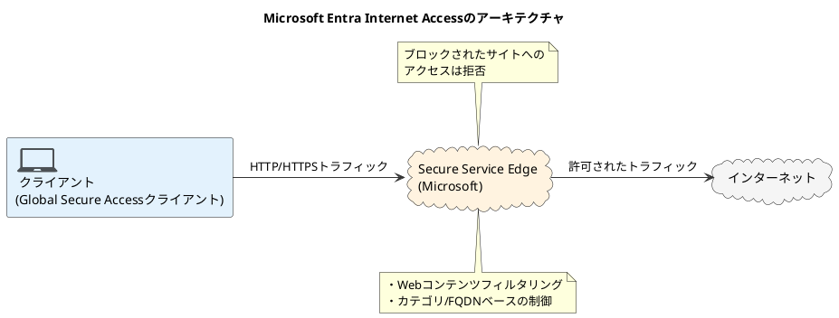
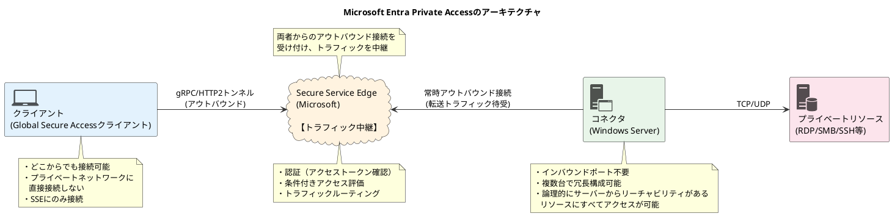

SaaSの利用やリモートワークが当たり前になった今、従来のVPNや境界型ファイアウォールだけでは、セキュリティを担保することが難しくなっています。
そこで注目されているのが、ユーザーのIDを起点にアクセス制御を行うSecurity Service Edge（SSE）というアプローチです。

Microsoft Entra Global Secure Accessは、インターネットへのアクセスを保護するMicrosoft Entra Internet Accessと、社内リソースへの安全なアクセスを提供するMicrosoft Entra Private Accessを統合したSSEソリューションです。

この記事では、Microsoft Entra Internet AccessとMicrosoft Entra Private Accessがどのようなしくみで動作し、何ができるのかについて紹介します。

設定や注意点、ハマりどころなどについては別の記事で紹介します。

* TOC
{:toc}

## Global Secure Accessクライアント

これから説明する、Microsoft Entra Internet AccessおよびMicrosoft Entra Private Accessを利用するには、クライアントデバイスにGlobal Secure Accessクライアントソフトウェアをインストールする必要があります。

執筆時点ではWindows、macOS、Androidがサポートされており、iOSがパブリックプレビュー中です。

Global Secure Accessクライアントは、プラットフォームごとに異なる技術を使用してトラフィックをインターセプトします。

| プラットフォーム | 実装方式 |
|---|---|
| Windows | ネットワークフィルタドライバ |
| macOS | TransparentProxy VPNタイプ |
| iOS | Microsoft Defender for Endpointアプリケーション内でローカルVPNとして動作 |
| Android | Microsoft Defender for Endpointアプリケーション内でローカルVPNとして動作 |

インターセプトしたトラフィックは、Microsoftが提供するSecure Service Edgeのサーバーに転送されます。
OSレベルで動作するため、後述の例外を除きあらゆるアプリケーションからのトラフィックが保護対象となります。

クライアントはエンドユーザーのIDを用いてEntra IDで認証します。認証方式はプラットフォームによって異なります。

| プラットフォーム | 認証方式 |
|---|---|
| Windows | Entra Joinの認証情報を使用[^hybrid-entra-join] |
| macOS | Microsoft Enterprise SSOプラグインを介して認証 |
| iOS | クライアント起動時に対話的に認証、またはMicrosoft Enterprise SSOプラグインを介して認証 |
| Android | クライアント起動時に対話的に認証 |

[^hybrid-entra-join]: Hybrid Entra Joinはサポート対象外です。

## Microsoft Entra Internet Access

Microsoft Entra Internet Accessは、Secure Web Gateway（SWG）として機能し、ユーザーがインターネット上の悪意のあるサイトにアクセスすることを防ぎます。





具体的には、以下のアクセスフィルタリングによって実現されます。

* Microsoft Internet Accessマネージドなカテゴリ
* 独自に定義するFQDN

### Webコンテンツフィルタリングポリシー

Webコンテンツフィルタリングポリシーは、カテゴリやFQDN（完全修飾ドメイン名）の論理的なグループです。各ポリシーには「許可（Allow）」または「ブロック（Block）」のいずれかのアクションを設定します。

- **Webカテゴリ**
  - ソーシャルネットワーキング、ギャンブル、ゲーム、暴力など、約76種類のカテゴリから選択
- **FQDN**
  - 特定のドメイン名を指定します。ワイルドカード（`*.example.com`など）も使用可能

たとえば、「Social」というポリシーを作成し、ソーシャルネットワーキングカテゴリをブロックしつつ、業務で必要なFacebookだけは別のポリシーで許可する、といった設定が可能です。

### トークンとセキュリティプロファイルID

GSAクライアントがEntra IDから取得するアクセストークンには、適用されるセキュリティプロファイルのIDがクレームとして含まれます。

クライアントからSecure Service Edgeにトラフィックが送信される際、このトークンも一緒に送られます。Secure Service Edgeは、トークン内のセキュリティプロファイルIDを参照し、該当するルールにもとづいてトラフィックを許可またはブロックします。

アクセストークンの有効期間は1時間のため、条件付きアクセスポリシーを変更したり、別のセキュリティプロファイルに切り替えたりした場合、反映には最大1時間かかる可能性があります。
一方、セキュリティプロファイル内のWebコンテンツフィルタリングポリシーの変更は、グローバルに伝播するだけですので、通常は数分で反映されます。

### ユーザー体験

ブロックされたサイトにアクセスしようとした場合、HTTPサイト（暗号化されていない通信）の場合は、より明確な「Denied」メッセージが表示されます。

HTTPSサイトの場合、「このサイトに到達できません」というブラウザのエラーメッセージが表示され、Internet Accessによってブロックされたのかどうかがわかりません。
TLSインスペクションを導入することで、HTTPサイトと同じように明確なメッセージを表示できる機能がパブリックプレビューになりました。

### Microsoft 365トラフィック用のMicrosoftプロファイル

これまで説明したInternet Accessプロファイルは、一般的なインターネットトラフィックを対象としています。
Microsoft 365（Exchange Online、SharePoint Online、Microsoft Teamsなど）へのトラフィックについては、専用の「Microsoftトラフィック転送プロファイル」が用意されています。

これによりパフォーマンスの向上やルールが簡素化するそうです。

#### Microsoftプロファイルにおける接続失敗時の動作

GSAクライアントがサービスへの接続に失敗した場合（認証エラーや条件付きアクセスの失敗など）、トラフィックは自動的にバイパスされ、クライアントのローカルネットワーク経由で直接送信されます。

この動作によるセキュリティリスクを軽減するために、準拠ネットワークチェック（Compliant Network Check）を使用した条件付きアクセスポリシーを作成し、クライアントがサービスに接続できない場合はトラフィックをブロックする設定が推奨されます。

詳細は[How to enable and manage the Microsoft traffic forwarding profile](https://learn.microsoft.com/en-us/entra/global-secure-access/how-to-manage-microsoft-profile)を参照してください。

## Microsoft Entra Private Access

Microsoft Entra Private Accessは、Zero Trust Network Access（ZTNA）を実現するソリューションです。

従来のVPNとは異なり、ネットワーク全体へのアクセスを許可するのではなく、特定のアプリケーションやリソースへのアクセスをIDを起点に細かく制御します。
SSEの文脈で、ゼロトラストの「常に検証する」「最小権限」をネットワークレイヤに適用する役割を担います。

### 従来のVPNの課題

従来のVPNは、以下のような課題を抱えています。

- **広範なネットワークアクセス** 
   - VPNトンネルが確立されると、ユーザーはネットワーク内のあらゆるリソースにアクセスできる
- **侵害の拡大リスク**
  - 1台のデバイスが侵害されると、VPN経由でネットワーク全体に攻撃が拡大する
- **ゼロトラスト原則との不整合**
  - 「常に検証する」「最小権限」「侵害を想定する」というゼロトラストの原則に反する

Microsoft Entra Private Accessは、これらの課題を解決するために設計されています。

### アーキテクチャの概要

主な構成要素は、クライアント、Secure Service Edge、コネクタ、プライベートリソースの4つです。





#### アーキテクチャのポイント

- **クライアントはプライベートネットワークに直接接続しない**
  - Global Secure AccessクライアントはSecure Service Edgeにのみ接続し、プライベートネットワークへの直接的なトンネルは張らない
- **コネクタはアウトバウンド接続のみ**
  - プライベートネットワーク内のコネクタがSecure Service Edgeに向けてアウトバウンド接続を確立するため、インバウンドのファイアウォールルールは不要
- **条件付きアクセスを評価**
  - アプリケーションへのアクセスごとに、ユーザーリスク、デバイス状態、場所などにもとづいた条件付きアクセスポリシーが評価可能

### コネクタの役割

コネクタは、プライベートネットワーク内でWindows Serverにインストールされるエージェントです。

#### コネクタの特徴

- **アウトバウンド接続のみ**
  - コネクタはSecure Service Edgeへのアウトバウンド接続を確立し、DMZやインバウンドポートの開放は不要
- **高可用性**
  - 複数のコネクタをデプロイすることで、冗長性と負荷分散を実現

### TCPとUDPのサポート

Microsoft Entra Private Accessの大きな特徴は、TCP/UDPの任意のポートを指定できる点です。

そのため、Webアプリケーションだけではなく、RDPやSSHなど非Webアプリケーションもサポートしています。

### Microsoft Entra Private Access用のサービスプリンシパルの定義

Microsoft Entra Private Accessでは、アクセスを許可するリソースを専用のサービスプリンシパルとして定義します。
これにより、VPNのような広範なネットワークアクセスではなく、人やグループなどを指定して必要最小限のリソースへのアクセスのみを許可できます。

### アプリケーションセグメント

Microsoft Entra Private Access用のサービスプリンシパルには、アプリケーションセグメントを設定できます。

以下の属性を1つの項目として、アプリケーションセグメントに設定できます。

- **宛先**: 単一のIPアドレス、CIDR、開始・終了アドレス、FQDN
- **プロトコル**: TCP、UDP
- **ポート**: ポート番号

#### セグメントの重複禁止

従来のIPルーティングでは、より具体的なルート（例: /26）がより広いルート（例: /24）よりも優先されますが、Microsoft Entra Private Accessではこのような動作はサポートされていません。

**異なるサービスプリンシパル間でアプリケーションセグメントが重複しないように**する必要があります。

一応確認したところ、登録時にエラーで弾かれるようにはなっていました。

### 宛先ごとの条件付きアクセスポリシーの適用

サービスプリンシパルですので、ほかのSaaSアプリケーションと同様に、条件付きアクセスポリシーを適用できます。

これにより、重要なリソースへのアクセスにはそもそも強力な認証を要求し、リスクが検出された場合はアクセスをブロックするといった、きめ細かな制御が可能になります。

## 終わりに

Microsoft Entra Global Secure Accessは、従来のVPNの課題を解決しつつ、ゼロトラストの原則にもとづいたアクセス制御を実現できるソリューションです。
Internet AccessによるSWG機能とPrivate AccessによるZTNA機能を組み合わせることで、インターネットアクセスと社内リソースへのアクセスの両方を統一的に管理できます。

設定や運用にはいくつかの注意点やハマりどころがありましたので、次回の記事では、実際の設定手順や注意点、トラブルシューティングのポイントについて紹介する予定です。
